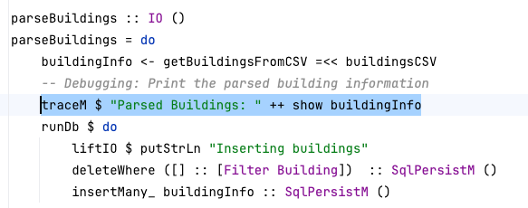
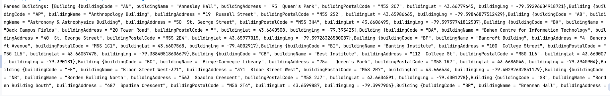
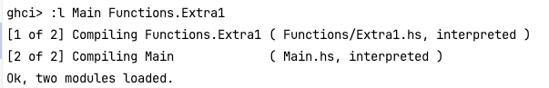
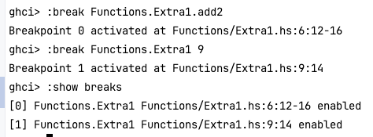
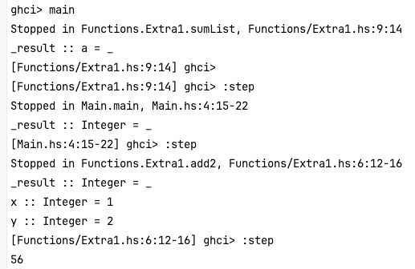
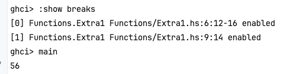
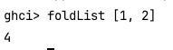
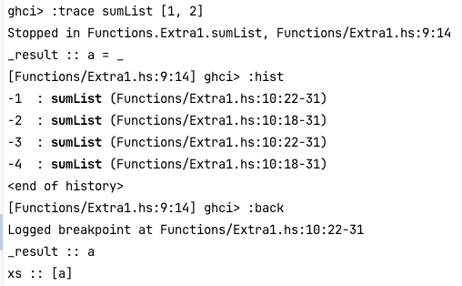

# An Introduction to Debugging in Haskell

## Introduction

There is a general purpose debugging guide available [here](https://wiki.haskell.org/Debugging), but it
is outdated and lacks information on how to navigate a modern debugger like gdb. This guide will look two main
cases for debugging a program in Haskell. The first being printing in the code using
[Debug.Trace](https://hackage.haskell.org/package/base-4.21.0.0/docs/Debug-Trace.html), a built-in package that great
for working through smaller problems. The second will focus on tracing through the code using the
[GHCi debugger](https://downloads.haskell.org/~ghc/8.10.3/docs/html/users_guide/ghci.html#the-ghci-debugger), which
is very closely related in function to gdb, the debugger used in C in courses like CSC209 and CSC369. **Note:** If
there are any issues or if any new commands, tools or features end up being useful, please update this guide
accordingly!

## Debug.Trace

This library is a quick and effective way to print values of objects in your Haskell Program. Please refer to the
documentation about which specific functions to use for your use case. To be more specific, a different function will
be called if you want to print a monad type object, a primitive type object or an algebraic datatype object. First you
need to `import Debug.Trace` at the top of your file. The following example below shows usage for a monadic type, since
Courseography is packed with Monads!

### Example

First we add `traceM` after the monad we want to view:



Then after running the program in the terminal, we get to see our monad's value!:



## GHCi Debugger

### Setup

After setting Courseography as the root in terminal, type in `stack ghci`. This will set up the environment for
debugger. Note this will not work if your program has compilation errors. Courseography has a lot of files already
embedded in a package, which stack automatically recognizes. If there is a case where a module `module0` is not imported,
you can load in `module0` by typing `:l module0` into the GHCi environment. This command can also load multiple files
at the same time: `:l module1 module2 module3 ...`. One more thing to note is that dependencies have to be imported at
the same time, or in order of dependency; meaning that if I am importing `module4` in `module5`, I have to import
both at the same time, or `module4` first.

### Breakpoints

Setting up breakpoints is done by the command `:break ModuleA.my_func` in the case you want to set the breakpoint at
a specific function in the module or `:break ModuleA line_number` if you want to set the breakpoint at a specific line.
In order to see the breakpoints set, use the command `:show breaks`. Breakpoints can be enabled/disabled with the
command `:enable/:disable breakpoint_number`. To enable/disable all breakpoints at the same time use
`:enable/:disable *`. Finally, to delete breakpoints use the command `:delete breakpoint_number` or to delete all use
`:delete *`.

### Program Trace

Once you have your breakpoints set, you can start running the program through the main entrypoint `main`. After, the
debugger will stop wherever you set your breakpoint. From this point the relevant variables and functions the program
is using should be viewable. Use the command `:info var_name` to see the object's type and `:print var_name` to see its
value. **Note that you can only use the main entry point once, i.e. you will have to restart the debugger**.

Stepping through the program can be done using `:step`. This will step through the program until the next breakpoint.
There are two variants `:steplocal` and `:stepmodule`, where the former limits the breakpoints that are enabled to the
scope of the current function and the latter restricts the scope of the breakpoints to the current module. **To reiterate
the point about the main entry point in the last paragraph, the first time `main` is called it will trace step by step
until the result of the entire program is printed, but if main is called again in the same session, it will be evaluated
and the stepper environment will not be available**.

Functions can also be called. Type the function and its input parameters directly into the debugger: `function inputs`.
The downside about doing this is that information is lost with respect to specific input values if this is done during
debugging with breakpoints. To be more specific, the debugger will tell you the algebraic types of the variables,
but it won't tell you what the actual values are.

You can also see an entire trace of debugging a function with `:trace`. Set the breakpoint at the function's base case/
step before evaluation. Then use `:hist` to see the previous steps. Use the command `:back` to backtrack steps. This
can be useful if you want to revisit one of the steps during the debug process, especially in recursive functions.

### Example

Here we use a toy project with modules `Main` and `Functions.Extra1`:

Main:

```aiignore
import Functions.Extra1(add2, sumList, foldList)

main :: IO ()
main = print (add2 1 2 + sumList [3, 4, 5, 6] + foldList [7, 8, 9, 10])
```

Functions.Extra1:

```aiignore
module Functions.Extra1 where

add2 ::(Num a) => a -> a -> a
add2 x y = x + y

sumList :: (Num a) => [a] -> a
sumList []     = 0
sumList (x:xs) = x + sumList xs

foldList :: (Num a) => [a] -> a
foldList x = foldl (+) 1 x
```

Now we start off by loading the files in the terminal:



Next we can set some breakpoints:



Now run through the entire program:



Unfortunately, we can't trace through the entire program unless we restart the debugger:



We can also try functions and inputs in isolation:



Finally, we back track through a trace and see old code:


