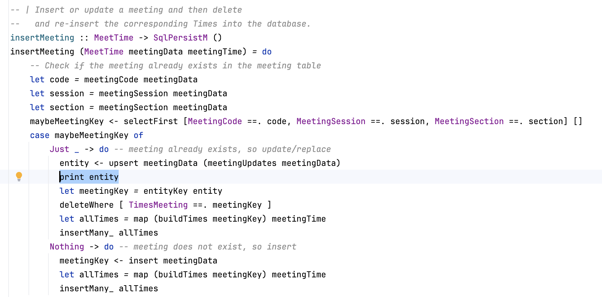
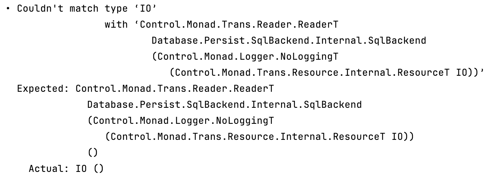
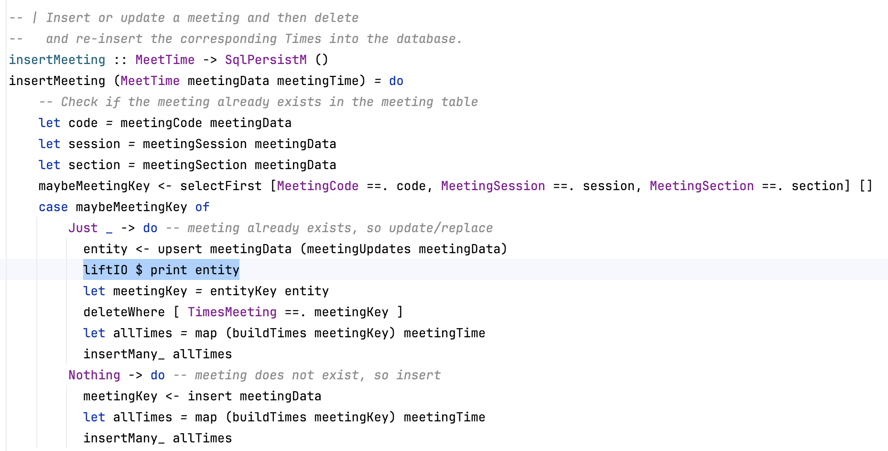
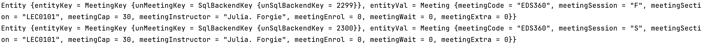

# An Introduction to Debugging in Haskell

## Introduction

There is a general purpose debugging guide available [here](https://wiki.haskell.org/Debugging), but it
is a tad outdated and lacks information on how to navigate a modern debugger like gdb. This guide will look two main
cases for debugging a program in Haskell. The first being tracing through the code using the GHCi debugger, which is
very closely related in function to gdb. The second will focus on print debugger, which can be quite useful when
working with monads and code that is nested in a do block. **Note:** If there are any issues with this guide or if any
new commands, tools or features end up being useful, please update this guide accordingly!

## GHCi Debugger

### Setup

After setting Courseography as the root in terminal, type in `stack ghci`. This will set up the environment for
debugger. Note this will not work if your program has compilation errors. Courseography has a lot of files already
embedded in a package, which stack automatically recognizes. If there is a case where a module `module0` is not imported,
you can load in `module0` by typing `:l module0` into the GHCi environment. This command can also load multiple files
at the same time: `:l module1 module2 module3 ...`. One more thing to note is that dependencies have to be imported at
the same time, or in order of dependency; meaning that if I am using importing `module4` in `module5`, I have to import
both at the same time, or `module4` first.

### Breakpoints

Setting up breakpoints is done by the command `:break ModuleA.my_func` in the case you want to set the breakpoint at
a specific function in the module or `:break ModuleA line_number` if you want to set the breakpoint at a specific line.
In order to see the breakpoints set, use the command `:show breaks`. Breakpoints can be enabled/disabled with the
command `:enable/:disable breakpoint_number`. To enable/disable all breakpoints at the same time use
`:enable/:disable *`. Finally, to delete breakpoints use the command `:delete breakpoint_number` or to delete all use
`:delete *`.

Nesting breakpoints is another feature **#TODO:**

### Program Trace

Once you have your breakpoints set, you can start running the program through the main entrypoint `main`. After, the
debugger will stop wherever you set your breakpoint. From this point the relevant variables and functions the program
is using should be viewable. Use the command `:info var_name` to see the object's type and `:print var_name` to see its
value.

Stepping through the program can be done using `:step`. This will execute the program until the next breakpoint. There
are two variants `:steplocal` and `:stepmodule`, where the former skips to the next breakpoint in the context of the
current function and the latter restricts to just breakpoints in the current module. **Add information on :next and
:continue**

**A quick note for navigating recursion:**

    1. Set the breakpoint at the line that contains the recursive step
    2. Print the intermediate values after each recursive call

### Example

## Print Statements

**TODO: FIX INTRO OF PRINT**

In most cases if the program compiles, you will get the desired output. This is the beauty of functional
programming. However, there will be cases where the wrong function from a library is used, or the function
you wrote is written incorrectly. In either of these cases, we can use print debugging like in other languages.
Before proceeding with this, you need to understand what Monads are. So if you haven't already, read the relevant
sections in [Learn you a Haskell](https://learnyouahaskell.github.io/chapters.html). You were supposed to for the
onboarding! The reason it's important is that print is a monad in Haskell, so it's not applicable in all cases. I.e.
you might have to modify your program into a monadic state either with bind (<<=) or with do notation to get it to
work. On the bright side, since this is a web application, monads are fruitful in this code base, so using print
statements should not be too challenging. One final caveat is using the keyword "liftIO". Once again depending on
the monads you are working with, there might be type compatibility issues. In this case you will have to reason
through types.

### Example Usage:

The example above highlights that print by itself sometimes won't work. An error about types comes up, but this
will be quite hard to debug with the ghci shell alone if you've never heard about liftIO. Using lifIO does remedy
this problem on the other hand.

Now we get the desired output in the terminal!
